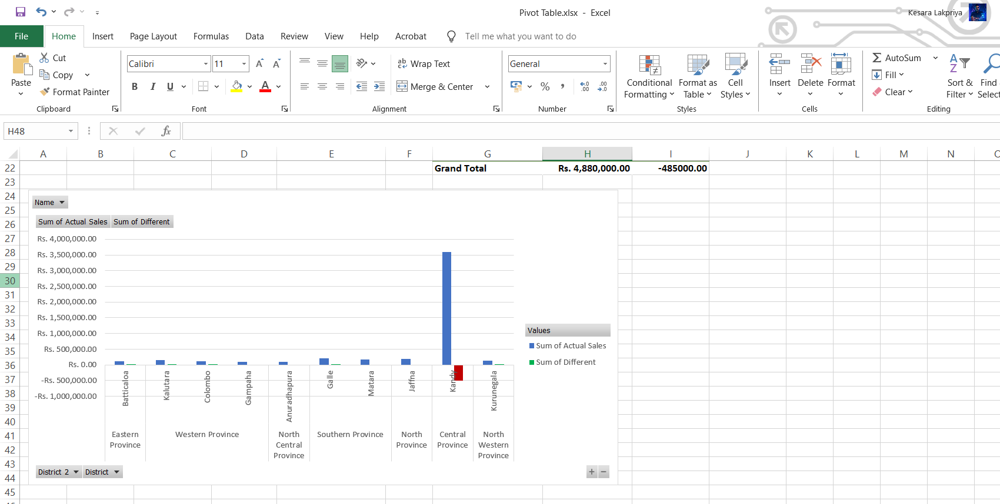

# Excel Sales Analysis Portfolio

## Overview

This project demonstrates practical business data analysis using Microsoft Excel. The analysis focuses on sales performance reporting through Pivot Tables, Pivot Charts, Slicers, and interactive reporting techniques.

The project was developed to gain hands-on experience in transforming raw sales data into meaningful business insights and reports.

---

## Skills Demonstrated

### Data Analysis

- Sales Performance Analysis
- Trend Analysis
- Data Summarization
- Business Reporting

### Pivot Table Features

- Pivot Tables
- Pivot Charts
- Slicers
- Grouping
- Report Filter Pages
- Top 5 Analysis

### Data Management

- Sorting
- Filtering
- Multiple Filters
- Calculated Columns
- Data Formatting
- Refresh and Update Operations

### Data Visualization

- Interactive Reports
- Sales Analytics
- Business Insights

---

## Tools Used

- Microsoft Excel

---

## Project Objectives

- Analyze sales performance data
- Create dynamic Pivot Table reports
- Generate interactive business reports
- Visualize key business metrics
- Support data-driven decision making

---

## Project Screenshots

### Sales Analysis

---

## Learning Outcomes

Through this project, I developed practical experience in Excel-based reporting, Pivot Table analysis, data visualization, and business intelligence techniques used in real-world analytical environments.

---

## Author

Kesara Lakpriya

Data Analyst | AI & Machine Learning Enthusiast | Python • SQL • Power BI • Data Visualization
